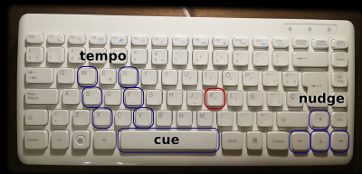
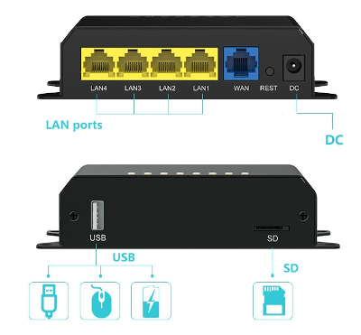

# Alsa DJ

Beat-mixing midi instruments and CDJs on Linux.

I write this to enable mixing a Roland TR-6s drum machine with a vinyl set.  a.k.a. dex, fx & 909.  The TR-6s has controls to stop, start and tempo adjust, but not with enough precision to beat-mix a drum track onto a playing record.  A midi controller or usb keyboard can be used to avoid having your laptop front and center.

## Features

- Cueing midi instruments, i.e. start / stop
- Nudging, i.e. speeding up or slowing down temporarily to catch up with a different track.
- Tempo adjust (ala pitch control)
- Keeping time with Pioneer CDJs, (using [libcdj](https://github.com/teknopaul/libcdj))
- Quantized restart, jump the midi device to the start of it's sequence on the next beat.
- Setting tempo to a precise value e.g. 123.04 bpm
- Light on CPU and RAM
- Sexy console UI
- Pluggable UI hooks
- Open source, natch.
- Written in C

## A picture speaks 4000 bytes.

## Build the binary

    git clone https://gitlab.com/teknopaul/libcdj
    (cd libcdj; make; sudo make install)

    sudo apt install libasound2-dev
    git clone https://gitlab.com/teknopaul/adj
    (cd adj; make; sudo make install)

`make deb` requires dpkg build tools, `make test` requires `sniprun`. Output is just a couple of files if you want to package for other distros.

Also builds on a [raspbery pi](https://www.raspberrypi.org/) model B with 500mb of RAM running raspbian. No need to cross compile, just install `gcc` and build tools.

## Overview/Usage

ADJ is a tool for beat mixing midi instruments, its not about auto-sync, quite the reverse. It enables you to manually beat-mix midi devices.

The main `adj` program is a cli app that starts an alsa sequencer, this can be connected to one or many synths or drum machines, either physical or virtual devices.

When the sequence is started, the instruments are started and the user can beat-mix the instruments to a different audio source.

e.g. a record is playing on one deck, `adj` can control a drum machine, so the drum machine can be synced to the playing vinyl before bringing the sound in on a typical DJ mixer.
Naturally ,you are going to want a 3 or more channel DJ mixer if you have 2 decks and want to use `adj` to beat mix a 909.

The DJ can cue in the drum machine, tempo adjust live to to the playing vinyl record, and nudge the sequence forwards and backwards to sync the beats.

Sync is not automated, you need to know how to beat mix already, (or want to have some fun learning how).

Controlling `adj` is performed with the keyboard or number pad, an external midi controller (or both midi and keyb).

If you use Pioneer CDJs/XDJs, `adj` can automatically keep midi instruments in sync with these decks, and it can keep CDJs in sync with midi.

## Connecting an external drum machine

Plugin the USB device.
    

`aconnect -l` prints list of connected midi devices.   `adj` needs to know the name of the device and the port.  In this case my TR-6s is client `28:0`, which as text is `'TR-6S:TR-6S MIDI 1    '`  note the whitespace.

    aconnect -l
    client 0: 'System' [type=kernel]
        0 'Timer           '
        1 'Announce        '
    client 14: 'Midi Through' [type=kernel]
        0 'Midi Through Port-0'
    client 24: 'nanoKONTROL Studio' [type=kernel,card=2]
        0 'nanoKONTROL Studio MIDI 1'
    client 28: 'TR-6S' [type=kernel,card=3]
        0 'TR-6S MIDI 1    '
        1 'TR-6S MIDI 2    '

To start `adj` connected to this device type

    adj -p 'TR-6S:TR-6S MIDI 1    '

You will need an input device either midi `-i`, or `-k` enables keyboard support.

    adj -i 'nanoKONTROL Studio:nanoKONTROL Studio MIDI 1' -p 'TR-6S:TR-6S MIDI 1    ' -k -y

Sequencer bpm defaults to 120.00 on startup, change with `-b 140`.

Hit space and you should hear the device start.  If you set `-e` the enter key works as well.  See below keyboard options for an explanation of the key bindings and options.

Config can be supplied as command line args to `adj` or set in a file `/etc/adj.conf`.

## Connecting Pioneer CDJs

The `-v`  option creates a virtual CDJ device in software that can communicate with Pioneer CDJs on the LAN.  `F1` to `F4` copies the bpm from a player 1 to 4 to adj's alsa sequencer and thus to midi devices.

`adj` does not auto-sync, you have to nudge the midi into time with the CDJs.  The difference between midi beat and the CDJ beat is listed per deck, the deck must be playing and in sync to within half a beat to track the diff.

    model:  [XDJ-1000    ] [XDJ-1000    ] [Alsa VDJ    ] [            ]
    player: [01 ▶️ ⚪🔴🔊 ] [02 ⏸️ ⚪⚪🔊 ] [03          ] [            ]
    bpm:    [120.01  ___♪] [000.00      ] [03      _♪__] [04          ]
    diff:   [+025        ] [            ] [            ] [            ]
    master: [01] [--] [----]

Once the midi and a CDJ is synchronized you can lock the midi sequencer to the beat of the deck, I find diff is usually around `+20` when the midi sequence and the CDJ are in sync. Typing `shift` + `U`, `I` ,`O` or `P` locks the midi sequence to the relevant player (1 to 4), this means `adj` keeps the diff the same by auto nudging the required number of milliseconds on the last beat of the bar.  N.B. this sounds real screwy if the BPMs are not more or less the same (use `F1` to `F4` to copy bpm first).  

N.B. there are alternative key bindings or you can map midi devices.

## Midi Mixing

Mixing midi devices is subtly different to mixing vinyl or CDJs.

### Cueing

There is only one cue point, the start of the "track", of course, for drum machines or a 303 the "track" is typically a loop, so this does not matter.

### BPM

BPM is visible, precision is 2 decimal places for CDJs, e.g. 120.00, unlike the TR-6S or Pioneer XDJ's that only report bpm to one decimal place.
BPM can be adjusted up or down or set to a precise specific value, (a feature missing from most CDJs)
Nudge is done with buttons, either on a normal PC keyboard, or an input midi controller, but due to the nature of generic controller, things are a little different from a CDJ.
If you have more money than sense you can use a CDJ to control `adj`, since Pioneer CDJs function as midi controllers.

### Tempo vs Pitch

There is no pitch adjust, just tempo adjust, i.e. faster or slower. This is kind of like having the "master tempo" button always pressed on a CDJ. There is no need to time-stretch this makes mixing subtly different since humans are tuned to pick up on very small frequency changes, and its more difficult to pick up on duration changes, there is nothing to go on until the beat sounds.
Tempo changes do not have a noticeable slide like pushing a vinyl record, that good for the audience but more complicated for the DJ. It takes a bit of getting used to if you mix vinyl, its the same as learning to mix Pioneer CDJs with master tempo set.

You can assign a midi slider to the tempo but it does not work like a Technics slider.
- A midi controller provides a number from 0 to 127, not very fine grained control.
- You cannot query a midi controller to find out in which position the slider is now, all you get is change notifications.
- We can use a slider to adjust tempo faster and slower like a CDJ only if the slider is in the middle position when the instrument starts.
- To make up for this you can turn the slider on and off to be able to reset its position.
- The result of this is that the slider is not limited to +/-8 it can be used to increment the BPM indefinitely in 0.1 bpm steps, no more hitting the end of the pitch adjust slider.
- However it is more fiddly to make big bpm adjustments compared to Technics.
- N.B. Pioneer CDJs are limited to +/- 100%, `adj` has no such limitation since there is no base bpm, but clearly you cant keep them in time if the CDJ hits its limit.

Naturally, `adj` holds its tempo pretty well, compared to Technics, and CDJs which surprisingly do tend to drift as they try to keep in sync across the network.

I had to make a decisions about resolution of the controls and the nudge amounts.  Too small changes and you have to nudge more often, too large and its not possible to perfectly sync.  I have presumed BPM around 120, if you are typically mixing Gabba at 220 BPM you might find the controls a little too precise, if you play stoner jazz at 60 bpm a little to lax.  Nudging is performed by increasing the tempo by 1 or 2 bpm for a single beat.  Hack at the code if that's an issue.

## UI

UI is a console afair. `libdj` is designed to support other UIs, so I might write a QT or GTK front end one day.   It not really necessary tho since input is performed with a physical midi controller (or pc keyboard) and the output is audio not the monitor. A fancy GUI does not add much benefit.

## The UI shows 

- Connected midi devices
- Current bpm
- Loop position, presuming you are mixing 4/4 music with a drum machine or groove box or similar.
- Phrase position, i.e. position with 4 bars.
- Some visual feed back for nudging, naturally you will more likely be paying attention to your headphone monitor.
- Indicators for start stop of the alsa sequencer, its possible to disconnect your devices, so its useful sometimes to know what is running and what is stopped.
- A bit of feed back regarding fiddling with the slider, phase, pitch adjust.
- Diffs across midi and CDJs, to some extent this allows you to mix by numbers. e.g. if you are mixing your own material you may get to know that two tracks need to be +25ms apart to be in sync.

.

    alsa port:   [adj:clock]  
    client_id:   [128:0]  
    midi in:     [nanoKONTROL Studio:nanoKONTROL Studio MIDI 1]  
    midi out:    [TR-6S:TR-6S MIDI 1    ]  
    keyb:        [on]  
    seq state:   [exit     ]  
    q state:     [paused   ]  
    bpm:         [120.00000]  
    events:      [0        ]  
    op:          [stop     ]  

    |...:...:...:...|...:...:...:...|...:...:...:...|...:...:...:...|

If `stdout` is not a tty, output is simply the timeline, e.g. if you pipe to `cat`

    adj -b 120 -i 'nanoKONTROL Studio:nanoKONTROL Studio MIDI 1' -p 'TR-6S:TR-6S MIDI 1    ' -k -y | cat

all you see is the beat and phrase points

    |...:...:...:...|...:...:...:...|...:...:...:...|

## Keyboard control

Two types of keyboard are supported.

### a normal keyboard

Type the bpm to two decimal places to set the value, no need to press enter.

### and a calculator style keyboard

You get less control over tempo with the calculator style keyboard/number pad.

## Midi Compatibility

Well, it's midi so pretty much compatible with any device, to map your controller to the actions in `adj` you need to setup `/etc/adj-midimap.adjmm` which is a symlink to a text file that maps events to midi control messages.  There not too much to setup to manually create the file, however `adj_midilearn`  can be used to help create the mapping file by punching buttons and twiddling knobs.

    adj_midilearn -i 'nanoKONTROL Studio:nanoKONTROL Studio MIDI 1' > my.adjmm

	# adj midi map
	#
	# nanoKONTROL uses channel 1, 127 = keydown, 0 = keyup
	#
	# N.B. ch 0 = omni
	#
	# name      ch ctrl  val

	start       0  80    127
	stop        0  63    127
	toggle      0  81    127
	q_restart   0  62    127

	nudge_fwd   0  61    127
	nudge_ffwd  0  59    127
	nudge_rew   0  60    127
	nudge_frew  0  58    127

	tempo_inc   0    57    127
	#tempo_inc_min
	#tempo_inc_1

	tempo_dec   0    56    127
	#tempo_dec_min
	#tempo_dec_1

	slider      2    12    *

	slider_on   2    37    127
	slider_off  2    28    127

## Audio latency

- This is midi toy, so there is no audio buffering, alsa seems to keep perfect time but takes significantly longer than 10ms to stop / start.
- Midi controllers have no delay (technically `snd_seq_event_input()` in blocking mode has some latency but its not noticeable)
- Quantized loop restarting seems to work better with alsa sync (`-y`).
- CDJ mixing requires alsa sync (`-y`).
- Some future version may implement times that attempt to predict alsa restart latency, its technically possible but fiddly.
- `libadj` is written in C and CPU usage on my laptop is minimal, even when running it uses less CPU than many idle applications.
- syncing based on the arrival of UDP packets naturally has latency involved.
- My XDJ-1000s mk1s cant keep time to millisecond resolution, my (newer) XDJ-700s seem to do a better job.

## Bugs

via github if you find something.
packet timing is ~20ms off not sure if this is libdj or CDJs themselves.

## Status

Basics tested on a single machine. Very much in development, API is not stable yet.

## Platforms

Currently testing on Intel hardware, new(ish) raspberry pi is in the mail.

Hopefully atargetting something like this 

## Author

teknopaul - hit me up on gitlab (or github)
